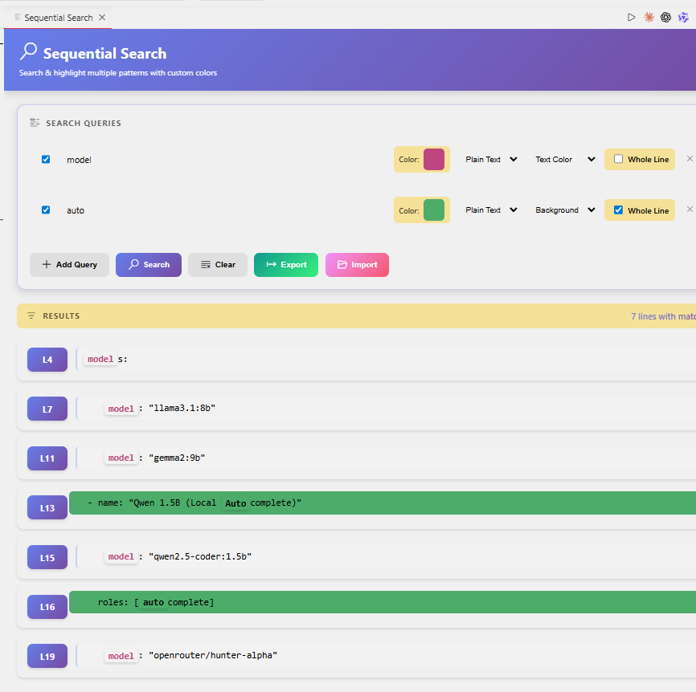

# Sequential Search

A powerful VS Code extension for searching multiple strings sequentially in a file with customizable highlighting. Perfect for log analysis, code review, and pattern matching. Similar to the "Analyze" plugin in Notepad++.


## ✨ Features

- 🔍 **Multi-Query Search** - Search for multiple strings or patterns simultaneously
- 🎨 **Customizable Colors** - Choose your own highlight colors for each query
- 📝 **Whole Line Highlight** - Highlight entire lines where matches are found
- 🌈 **Foreground/Background** - Choose between text color or background highlight
- 💾 **Export/Import** - Save and load your query configurations as JSON files
- 🔃 **Regex Support** - Use regular expressions for advanced pattern matching
- 📊 **Results Panel** - Click on results to navigate directly to matching lines
- 🚀 **Fast & Efficient** - Optimized for large files and log analysis

## 🚀 Quick Start

1. Open any file in VS Code
2. Press `Ctrl+Shift+P` (Windows/Linux) or `Cmd+Shift+P` (Mac)
3. Type **"Sequential Search"** and press Enter
4. The search panel opens beside your editor
5. Enter your search queries and click **Search**

## 📖 Usage Guide

### Basic Search

1. Enter your search text in the query field
2. Choose a highlight color using the color picker
3. Click **Search** to find all matches

### Advanced Options

| Option | Description |
|--------|-------------|
| **Plain Text** | Simple text search (default) |
| **Regex** | Use regular expressions for pattern matching |
| **Background** | Highlight with background color |
| **Text Color** | Change the text color itself |
| **Whole Line** | Highlight the entire line where match is found |

### Managing Queries

- ➕ **Add Query** - Add more search patterns
- ❌ **Remove** - Click the ✕ button to remove a query
- ✅ **Enable/Disable** - Toggle individual queries without deleting
- 💾 **Export** - Save all queries to a JSON file
- 📂 **Import** - Load queries from a JSON file
- 🗑️ **Clear** - Remove all highlights and results

### Keyboard Shortcuts

- Press **Enter** in any query field to quickly search

## 🎯 Use Cases

- 📄 **Log Analysis** - Find ERROR, WARNING, INFO patterns with different colors
- 🔧 **Code Review** - Highlight TODO, FIXME, HACK comments
- 🐛 **Debugging** - Search for multiple variable names or function calls
- 📊 **Data Analysis** - Find specific patterns in CSV, JSON, or XML files
- 📝 **Text Processing** - Multi-pattern search in any text file

## 📸 Screenshots

### Search Panel




## ⚙️ Configuration

The extension saves your queries automatically. You can also:

- **Export Queries**: Click the Export button to save queries as a JSON file
- **Import Queries**: Click the Import button to load saved queries
- **Share Configurations**: Share JSON files with your team for consistent analysis

### Example: Log Analysis Setup

```json
{
  "version": "1.0",
  "queries": [
    {
      "enabled": true,
      "query": "ERROR",
      "color": "#ff0000",
      "type": "plain",
      "colorType": "background",
      "isWholeLine": true
    },
    {
      "enabled": true,
      "query": "WARNING",
      "color": "#ffff00",
      "type": "plain",
      "colorType": "background",
      "isWholeLine": false
    },
    {
      "enabled": true,
      "query": "DEBUG",
      "color": "#00ff00",
      "type": "plain",
      "colorType": "foreground",
      "isWholeLine": false
    }
  ]
}
```

## 🛠️ Development

### Build from Source

```bash
# Clone the repository
git clone https://github.com/rajvesh/vscode-sequential-search.git

# Navigate to the extension folder
cd vscode-sequential-search

# Install dependencies
npm install

# Compile TypeScript
npm run compile

# Run the extension (opens Extension Development Host)
# Press F5 in VS Code
```

### Package the Extension

```bash
npm install -g @vscode/vsce
vsce package
```

This creates a `.vsix` file that can be installed manually.

## 🤝 Contributing

Contributions are welcome! Here's how you can help:

1. Fork the repository
2. Create a feature branch: `git checkout -b feature/amazing-feature`
3. Commit your changes: `git commit -m 'Add amazing feature'`
4. Push to the branch: `git push origin feature/amazing-feature`
5. Open a Pull Request

### Reporting Issues

Found a bug or have a feature request? Please open an issue on [GitHub](https://github.com/rajvesh/vscode-sequential-search/issues).

## 📄 License

This project is licensed under the MIT License - see the [LICENSE](LICENSE) file for details.

## 🙏 Acknowledgments

- Inspired by the "Analyze" plugin in Notepad++
- Built with [VS Code Webview UI Toolkit](https://github.com/microsoft/vscode-webview-ui-toolkit)
- Icons by [VS Code Codicons](https://github.com/microsoft/vscode-codicons)

## 📬 Contact

- **Publisher**: Rajesh Vasireddy
- **GitHub**: [@rajvesh](https://github.com/rajvesh)
- **Repository**: [vscode-sequential-search](https://github.com/rajvesh/vscode-sequential-search)

---

**Enjoy using Sequential Search!** 🎉

If you find this extension helpful, please consider giving it a ⭐️ rating in the VS Code Marketplace!
